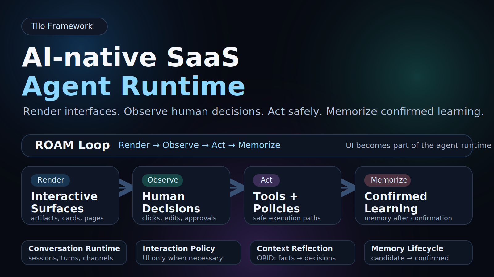

# Tilo Framework

<p align="center">
  <strong>The AI-native runtime for agents that turn human decisions into actions and confirmed memory.</strong>
</p>

<p align="center">
  <a href="./README.zh-CN.md">中文</a> ·
  <a href="./docs/INTEGRATION_GUIDE.md">Integration</a> ·
  <a href="./docs/BUILD_YOUR_FIRST_TILO_APP.md">Build an App</a> ·
  <a href="./docs/ARTIFACT_ACTION_RUNTIME.md">Action Runtime</a> ·
  <a href="./docs/MEMORY.md">Memory</a> ·
  <a href="./docs/README.md">Docs</a>
</p>

<p align="center">
  
  
  
  
  
  
  
  
</p>

<p align="center">
  
</p>

---

## 30-second version

Tilo is an open-source framework for building **AI-native product flows** where agents render focused surfaces, ask humans for decisions, execute actions through the backend runtime, and only memorize confirmed learning.

It is not a SaaS dashboard with an AI sidebar. It is the runtime layer for:

```text
Goal -> Surface -> Decision -> Action -> Memory
```

```bash
git clone https://github.com/adam2go/tilo-framework.git && cd tilo-framework && cp .env.example .env && docker compose up --build
```

Open:

```text
http://localhost:3000/demo
```

You should see the minimal Contract Review demo: a goal-first conversation, a focused workspace, an approval action, and an optional memory confirmation. No API key is required in deterministic mode.

---

## When to use Tilo

Use Tilo when your product needs an agent to:

- turn a user goal into a focused decision surface;
- execute meaningful user actions through backend-owned semantics;
- keep an audit trail of observations;
- propose memory, but require human confirmation before recall.

Do not use Tilo as a generic dashboard template or an AI chat sidebar.

---

## What is different?

### 1. Confirmed memory, not automatic memory

Many agents write memory automatically. That can pollute evaluations, store wrong preferences, and make users feel out of control.

Tilo treats memory as a lifecycle:

```text
Observation -> Memory Candidate -> Human Confirmation -> Confirmed Memory
```

The agent can propose what it learned. The user decides what becomes durable.

### 2. Backend-owned action semantics

In many AI demos, a frontend button directly calls an API and mutates state. That breaks auditability and makes every channel reimplement the same logic.

Tilo routes meaningful actions through the backend Artifact Action Runtime:

```text
User action -> ArtifactActionRuntime -> UIInteractionEvent -> ConversationTurn(observation) -> safe side effect
```

The frontend renders intent. The backend owns action semantics.

---

## Protocol Boundary

MCP connects tools. AG-UI streams agent/UI events. LangGraph orchestrates workflows. Tilo owns the AI-native product runtime loop: `Goal -> Surface -> Decision -> Action -> Memory`.

---

## Quick Start

Run the demo locally:

```bash
git clone https://github.com/adam2go/tilo-framework.git
cd tilo-framework
cp .env.example .env
docker compose up --build
```

Open:

```text
http://localhost:3000/demo
```

Check the backend:

```bash
curl http://localhost:8000/api/health
```

Verify the local demo without any API key:

```bash
bash scripts/verify_local_demo.sh
```

Expected result:

```text
✓ backend health ok
✓ frontend /demo route ok
✓ example apps loaded
✓ conversation session created
✓ conversation-native message endpoint completed
✓ demo verification complete
```

The older `/demo/telegram` route redirects to `/demo` for compatibility; it is no longer a separate public demo.

---

## How developers integrate Tilo

Tilo can be adopted gradually. You do not need to rewrite your product.

| Mode | Use when | Integration boundary |
|---|---|---|
| Standalone demo | You want to evaluate Tilo locally | Run `/demo` |
| Backend runtime sidecar | You already have a frontend | Call Tilo REST APIs |
| Embedded components | You want a reference AI-native UI | Reuse artifact/action components |
| Declarative Tilo app | You want to package an agent workflow | `app.yaml` + `interaction.policy.yaml` |

Start here: [`docs/INTEGRATION_GUIDE.md`](./docs/INTEGRATION_GUIDE.md)

Core APIs:

```text
POST /api/conversations
POST /api/conversations/{session_id}/messages
GET  /api/artifacts?workspace_id=...&task_id=...
POST /api/artifacts/{artifact_id}/actions/{action_id}
POST /api/memories/{memory_id}/confirm
```

---

## Build an Agent App

A Tilo app is a small declarative folder:

```text
app.yaml
interaction.policy.yaml
fixtures or sample inputs
optional README
```

Start with:

```text
examples/apps/contract-review-agent/
examples/apps/sales-followup-agent/
```

Create a new app:

```bash
python scripts/create_app.py my-agent
python scripts/validate_app.py examples/apps/my-agent
```

Developer references:

- [`docs/BUILD_YOUR_FIRST_TILO_APP.md`](./docs/BUILD_YOUR_FIRST_TILO_APP.md)
- [`docs/APP_MANIFEST.md`](./docs/APP_MANIFEST.md)
- [`docs/INTERACTION_POLICY.md`](./docs/INTERACTION_POLICY.md)
- [`examples/apps/README.md`](./examples/apps/README.md)

---

## What You Can Build

| Example | What Tilo proves |
|---|---|
| Contract Review Agent | Decision surfaces, approval actions, revision drafts, confirmed memory |
| Sales Follow-up Agent | Declarative app portability across a second workflow |
| Future examples | More domains without changing the core runtime contract |

---

## Runtime model

```text
Agent App Manifest
-> Interaction Policy
-> Artifact Spec
-> Artifact Action Runtime
-> UIInteractionEvent
-> ConversationTurn(observation)
-> Memory Candidate
-> Human Confirmation
-> Confirmed Memory
```

Tilo is protocol-aware but not protocol-led. MCP, AG-UI, ACP, or A2A can be boundary adapters. Tilo owns the product runtime loop: goal, surface, decision, action, and memory.

See [`docs/SKILL_TOOL_MCP_BOUNDARIES.md`](./docs/SKILL_TOOL_MCP_BOUNDARIES.md) for the Skill / Tool / MCP boundary.

---

## Repository Map

```text
backend/       FastAPI backend and AI-native runtime contracts
frontend/      Next.js reference UI and minimal /demo implementation
examples/      Declarative agent app examples and fixtures
docs/          Stable concepts, integration guide, release docs, implementation history
evals/         Runtime quality checks and baseline metrics
scripts/       App validation, scaffold, and local demo verification
```

---

## Roadmap Focus

Current focus before adding more features:

1. Make README and demo conversion-grade.
2. Keep local verification green in CI.
3. Prove the second example app without changing framework code.
4. Clarify Skill / Tool / MCP boundaries.
5. Split ArtifactSpec blocks into core and extension tiers.
6. Add baseline eval metrics for surface rendering, action completion, and memory acceptance.

Baseline eval: [`evals/baseline_report.md`](./evals/baseline_report.md)

---

## Docs / Contributing

- [`docs/README.md`](./docs/README.md)
- [`docs/AI_NATIVE_FRAMEWORK_PRINCIPLES.md`](./docs/AI_NATIVE_FRAMEWORK_PRINCIPLES.md)
- [`docs/INTEGRATION_GUIDE.md`](./docs/INTEGRATION_GUIDE.md)
- [`docs/ARTIFACT_ACTION_RUNTIME.md`](./docs/ARTIFACT_ACTION_RUNTIME.md)
- [`docs/MEMORY.md`](./docs/MEMORY.md)
- [`docs/SKILL_TOOL_MCP_BOUNDARIES.md`](./docs/SKILL_TOOL_MCP_BOUNDARIES.md)
- [`docs/RELEASE_V1_0.md`](./docs/RELEASE_V1_0.md)

Tilo is early. Contributions are welcome.

Before contributing, please read:

- [`AGENTS.md`](./AGENTS.md)
- [`CONTRIBUTING.md`](./CONTRIBUTING.md)
- [`docs/PROJECT_CONSTITUTION.md`](./docs/PROJECT_CONSTITUTION.md)
- [`docs/QUALITY_BAR.md`](./docs/QUALITY_BAR.md)

The most important rule:

> Do not turn Tilo into SaaS plus AI. Preserve the AI-native runtime loop: Goal -> Surface -> Decision -> Action -> Memory.

---

## License

Apache License 2.0
