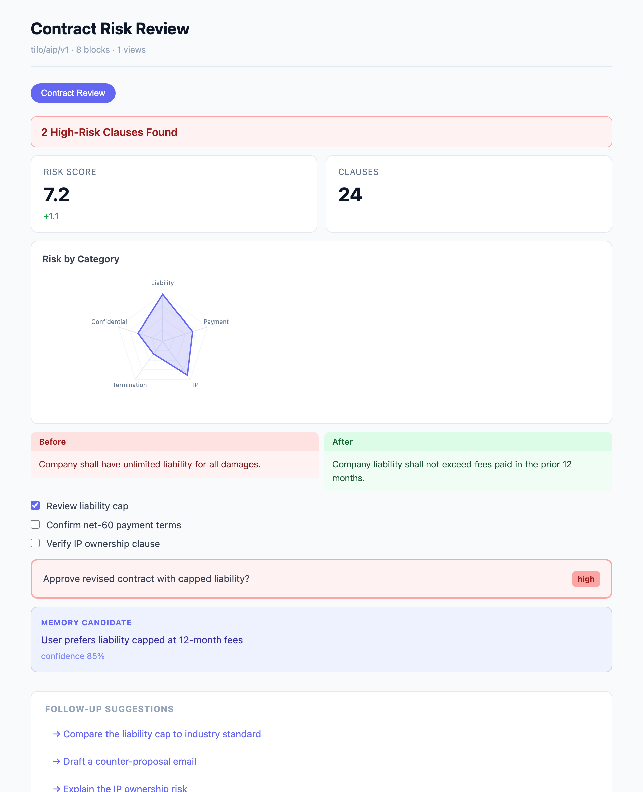

# Tilo Framework

<p align="center">
  <strong>Turn any LLM into an interactive UI. One line of Python — no React, no frontend setup.</strong>
</p>

<p align="center">
  <a href="./README.zh-CN.md">中文</a> ·
  <a href="./docs/tutorials/quickstart.md">5-min Quickstart</a> ·
  <a href="./docs/AIP_DESIGN.md">AIP Design</a> ·
  <a href="./docs/INTEGRATION_GUIDE.md">Integration</a> ·
  <a href="./examples/integrations/">Examples</a> ·
  <a href="./docs/README.md">Docs</a>
</p>

<p align="center">
  <a href="https://pypi.org/project/tilo/"></a>
  <a href="https://www.npmjs.com/package/@adam2go/tilo-react"></a>
  <a href="https://github.com/adam2go/tilo-framework/actions/workflows/ci.yml"></a>
  
  
</p>

---

## 30 seconds to your first surface

```bash
pip install tilo openai
```

```python
import tilo

spec = tilo.generate(
    "Review this SaaS contract for payment, liability, and IP risks.",
    model="gpt-4o",          # or claude-opus-4-8 — provider auto-detected
)

tilo.view(spec)              # opens in your browser. that's it.
```

The LLM doesn't return a wall of text — it generates a **structured,
interactive surface**: a risk chart, a before/after diff, a checklist, a
human-approval gate, and a memory card, organised into tabs. Rendered with
**zero frontend setup**.

<p align="center">
  
</p>

> No API key? Run `tilo demo` to open this exact surface from a sample spec.
> Want to tinker? `tilo serve` then open `http://localhost:8000/playground`
> — a live editor: paste any spec, see it render instantly.

---

## Why this matters as LLMs get stronger

Stronger models make text answers better — but a wall of text is still a
wall of text. The bottleneck isn't *what* the model knows, it's *how the
user acts on it*. Tilo turns model output into something a human can
**click, edit, approve, and reject** — and turns those actions back into
structured signal the model can learn from.

Three things stay valuable no matter how good the model gets:

1. **Structured UI beats prose** for decisions. A risk chart + approval gate
   beats three paragraphs, every time.
2. **Human confirmation is infrastructure, not a feature.** Stronger models
   take higher-stakes actions → you need *more* structured gates, not fewer.
3. **Confirmed memory, not auto-memory.** A confident model that auto-saves a
   wrong preference is dangerous. Tilo proposes; the human confirms.

---

## The full ROAM-loop demo

A real Tilo run — agent recalls memory, plans, calls tools, generates an
interactive artifact, and hands it back as live, clickable UI.
**Zero LLM key required for this demo.**

https://github.com/user-attachments/assets/1afed79d-e85e-414a-954f-e0be136b9c7d

> **Plan a SF weekend** — runs entirely from a baked-in fixture. Two more
> demos (PR Review · Sales Briefing) further down. ↓

<p align="center">
  
</p>

---

## Works with your stack

Already using OpenAI, Anthropic, or LangChain? One import.

```python
# OpenAI
from tilo.adapters.openai import generate_aip_spec
spec = generate_aip_spec(OpenAI(), "Analyse Q3 pipeline", skill="sales_dashboard")

# Anthropic
from tilo.adapters.anthropic_sdk import generate_aip_spec
spec = generate_aip_spec(Anthropic(), "Review this PR", skill="code_review", document=diff)

# LangChain / LangGraph
from tilo.adapters.langchain import generate_aip_spec
spec = generate_aip_spec(ChatOpenAI(model="gpt-4o"), "Plan a trip to Tokyo")
```

```python
# Already on AG-UI / CopilotKit? Emit a Tilo surface into the stream:
from tilo.adapters.agui import tilo_spec_to_agui_events
events = tilo_spec_to_agui_events(spec)
```

12 built-in **skills** (contract review, code review, incident response,
meeting summary, bug report, trip planning, …) shape the output for your
domain — or load your own `skill.yaml`. Bring your own LLM client with
`AIPPromptBuilder`, or convert an existing response you already have.

---

## Why Tilo

**Tilo is a library, not a framework.** You already have an agent (your own
loop, LangGraph, CrewAI, whatever). Tilo does one thing: it turns a model's
output into a **structured, interactive surface** — a declarative spec of
typed blocks (chart, diff, table, checklist, confirmation, memory card) that
renders anywhere, from one function call, with no frontend.

```python
spec = tilo.generate("Review this contract", model="gpt-4o")  # → a spec (data)
tilo.view(spec)                                                # → rendered, no React
```

The lean install is just that: `pip install tilo` pulls **only pydantic +
PyYAML**. The full server runtime (sessions, memory, the ROAM loop) is an
opt-in `tilo[server]` extra — most people never need it.

### Complementary to the rest of the stack

Tilo doesn't replace your tools, orchestrator, or agent-UI transport — it
slots in as the layer that produces the *structured view*.

| Layer | Owned by | Tilo's relationship |
|---|---|---|
| Tool calling | MCP | `mcp_*` adapter → render tool results as a surface |
| Orchestration | LangChain / CrewAI / LangGraph | `generate_aip_spec(llm, …)` from your chain |
| Agent ↔ app transport | **AG-UI** (CopilotKit) | **interop adapter** — emit a Tilo surface as an AG-UI event |
| Agent-to-agent | A2A / ACP | `a2a_*` / `acp_*` adapters → render results |

### Tilo and AG-UI work together (not against)

[AG-UI](https://docs.ag-ui.com) is an event-streaming **protocol** that carries
an agent's live activity into a chat/copilot UI (via CopilotKit). Tilo produces
a **declarative artifact** you can render with or without a frontend. They
compose: let your AG-UI agent emit a Tilo surface as generative UI.

|                       | **AG-UI**                                  | **Tilo**                                            |
|-----------------------|--------------------------------------------|-----------------------------------------------------|
| Shape                 | Event stream (process)                     | Declarative spec (one artifact)                     |
| Frontend              | Needs a client runtime (CopilotKit)        | Renders anywhere — browser / Jupyter / HTML / React |
| UI form               | Chat / copilot                             | Structured surface (report, review, dashboard)      |
| Integration cost      | Adopt the protocol + wire a frontend       | `pip install tilo` + one function                   |

```python
from tilo.adapters.agui import tilo_spec_to_agui_events
events = tilo_spec_to_agui_events(spec)   # stream into a CopilotKit app
```

---

## Three ways to run

| Goal | Install | What you get |
|---|---|---|
| **See a surface now** | `pip install tilo` → `tilo demo` | A sample surface opens in your browser (lean: pydantic + PyYAML only) |
| **Generate from your LLM** | `pip install "tilo[openai]"` → `tilo generate "…"` | Your prompt → a rendered surface |
| **Full ROAM loop + frontend** | `pip install "tilo[server]"` (or `git clone … && make dev`) | Backend `:8000` + reference UI `:4001` |

The default `pip install tilo` is a lightweight library. The FastAPI server,
database, and `/playground` only come with the `tilo[server]` extra. The full
stack adds sessions, runs, confirmed memory, and the reference React Canvas:

```bash
git clone https://github.com/adam2go/tilo-framework.git
cd tilo-framework && make install && make dev
```

- `http://localhost:8000/playground` — paste a spec, see it render live
- `http://localhost:4001/canvas` — **3D Agent Canvas**: watch the agent stream a live trace
- `http://localhost:4001/demo` — classic scenario picker

> **Zero-config.** Everything works without an API key in deterministic mode.
> Add `LLM_ENABLED=true` + a provider key in `.env` for live LLM generation.

---

## How it fits together

The library is three small layers — a **spec**, **adapters** that produce it,
and **renderers** that draw it. Everything else (the full runtime) is optional.

### Layer 1 — The spec

~20 **primitive block types** (like HTML tags: `markdown`, `table`, `chart`, `diff`, `form`, `card`, …) plus an open extension mechanism. Any string is a valid block type — unknown types render with a generic JSON fallback. The spec is plain JSON, so it travels and renders anywhere.

### Layer 2 — LLM Adapters

Each adapter offers two modes: **generate** a full surface (the LLM authors
chart/diff/confirmation/memory blocks), or **convert** a response you already
have (simpler text/metric/table/tool blocks).

| Adapter | Status | Import |
|---|---|---|
| **OpenAI** | ✅ | `from tilo.adapters.openai import generate_aip_spec` |
| **Anthropic** | ✅ | `from tilo.adapters.anthropic_sdk import generate_aip_spec` |
| **LangChain** | ✅ | `from tilo.adapters.langchain import generate_aip_spec` |
| **MCP** | ✅ | `from tilo.adapters.mcp import mcp_content_to_blocks` |
| **A2A** | ✅ | `from tilo.adapters.a2a import a2a_task_to_spec` |
| **ACP** | ✅ | `from tilo.adapters.acp import acp_message_to_spec` |
| **AG-UI** | ✅ | `from tilo.adapters.agui import tilo_spec_to_agui_events` (interop) |

Bring your own client with `AIPPromptBuilder` (works with any LLM), or just
call `tilo.generate(goal, model=…)` and let Tilo pick the provider.

### Layer 3 — Renderer SDKs

Tilo Spec JSON → any frontend.

- **Zero-setup**: `tilo.view(spec)` (browser), `tilo.notebook(spec)` (Jupyter),
  `tilo.to_html(spec)` (standalone HTML) — no Node, no build step.
- **Production React**: `@adam2go/tilo-react` — `TiloRenderer` with per-block
  overrides, or `renderArtifactBlock` for one-off blocks.
- **Your own SDK**: the spec is plain JSON; build a renderer for Vue, Flutter,
  Web Components, or a terminal CLI.

### Layer 4 — Skill Hints + LLM Composition

Skills provide **hints** (recommended block types, view organization) to the LLM. The LLM has full autonomy to decide the final views, blocks, and layout. Skills are recommendations, not constraints.

---

## Three Built-in Demos

| Scenario | What the agent does | Mode |
|---|---|---|
| **PR Review** 🔍 | Flags risky changes in a pull request, lists verification items, gates the merge with a confirmation | LLM |
| **SF Trip** ✈️ | Plans a 3-day weekend with timeline, hotels, packing checklist, budget — fully interactive | offline · zero-config |
| **Sales Briefing** 📊 | Surfaces pipeline metrics + recommended actions + a ready-to-send email behind a confirmation | LLM |

The SF Trip video is at the top of this page. The other two:

<table>
  <tr>
    <td width="50%" valign="top">
      <h4>🔍 PR Review</h4>

https://github.com/user-attachments/assets/3795a3a8-aedb-4996-ae18-42f7c3e2c45f

  <sub>Auth-refactor PR · diffs + verification checklist + merge confirmation. <b>53s</b> · <a href="https://github.com/adam2go/tilo-framework/releases/download/v0.1-demos/canvas-pr-review.mp4">HQ download (42 MB)</a></sub>
    </td>
    <td width="50%" valign="top">
      <h4>📊 Sales Briefing</h4>

https://github.com/user-attachments/assets/1847718a-586d-4e80-b9fd-6eade1d35b35

  <sub>Pipeline metrics + recommended actions + gated outbound email. <b>68s</b> · <a href="https://github.com/adam2go/tilo-framework/releases/download/v0.1-demos/canvas-sales-briefing.mp4">HQ download (36 MB)</a></sub>
    </td>
  </tr>
</table>

See [`docs/demos/`](./docs/demos/README.md) for the full goal text and reproduction steps.

[demos-release]: https://github.com/adam2go/tilo-framework/releases/tag/v0.1-demos

---

## Optional: the full runtime (`tilo[server]`)

Most people use Tilo as a library: `generate → spec → render`, done. But if you
*don't* already have an agent backend and want the whole loop, `tilo[server]`
adds a FastAPI runtime that closes the **two-way loop** — not just agent → UI,
but UI → agent:

```text
1.  Agent emits a spec          →  blocks + views, declarative JSON
2.  Renderer paints the UI      →  @adam2go/tilo-react / your own
3.  User clicks / edits / confirms
4.  Backend records the action  →  UIInteractionEvent + observation
5.  Next agent turn reasons over what the user actually did, not pixels
```

Two design choices keep it safe — and these are the parts worth borrowing even
if you don't use the server:

- **Confirmed memory, not automatic memory.** The agent proposes what it
  learned (`memory_card`); the user decides what sticks.
- **Backend-owned action semantics.** The frontend renders intent; the backend
  decides what actually happens — high-risk actions stay gated behind a
  `confirmation` block.

This is the heavier path. If you already have your own agent, you don't need it
— just `pip install tilo` and use `generate` / `view`.

---

## How Developers Integrate

| Mode | When to use | What you touch |
|---|---|---|
| **One-liner** | Just want a surface | `tilo.generate(goal, model="gpt-4o")` → `tilo.view(spec)` |
| **Your LLM client** | Already have OpenAI/Anthropic/LangChain | `generate_aip_spec(client, goal, skill=…)` |
| **Bring-your-own LLM** | Custom client or provider | `AIPPromptBuilder(goal).system_prompt()` / `.parse(out)` |
| **Convert a response** | Already have LLM output | `tilo_spec_from_completion(response)` |
| **Zero-setup render** | No Node / build step | `tilo.view` / `tilo.notebook` / `tilo.to_html` |
| **Production React** | Have a React app | `@adam2go/tilo-react` — `TiloRenderer`, `renderArtifactBlock` |
| **Backend sidecar** | Full ROAM loop, your frontend | Call Tilo REST APIs |
| **Skill author** | Package a repeatable workflow | `skill.yaml` with `block_hints` + `view_hints` |
| **Declarative app** | Full agent workflow | `app.yaml` + `interaction.policy.yaml` |

Core APIs:

```text
POST /api/conversations                          Create a session
POST /api/conversations/{id}/messages             Send a message → Task → Run
GET  /api/runs/{id}/trace                         Live trace stream
GET  /api/artifacts?workspace_id=...&task_id=...  Full artifact with views
POST /api/memories/{id}/confirm                   Confirm a memory candidate
```

See the [5-minute quickstart](./docs/tutorials/quickstart.md), [`examples/integrations/`](./examples/integrations/), [`docs/INTEGRATION_GUIDE.md`](./docs/INTEGRATION_GUIDE.md) and [`docs/AIP_DESIGN.md`](./docs/AIP_DESIGN.md).

---

## Repository Structure

```text
backend/       Python package `tilo` — FastAPI runtime, pip-installable
  tilo/adapters/   MCP, LangChain, A2A, ACP protocol adapters
  tilo/schemas/    AIP v1 spec: ~20 primitive block types + open extension
  tilo/services/   Memory, Confirmation, Trace, Artifact, Skills
frontend/      @adam2go/tilo-react — Next.js reference UI, artifact-driven Canvas
skills/        Skill YAML definitions with block_hints + view_hints
examples/      Declarative agent apps and contract fixtures
docs/          Architecture, AIP design, integration guide, principles
evals/         Runtime quality checks and baseline metrics
```

---

## Roadmap

**v0.1 (current)** — Complete working loop + AIP architecture.

- [x] Task → Run → Trace → Artifact → Surface → Confirmation → Memory loop
- [x] Three demo scenarios (PR Review, SF Trip, Sales Briefing)
- [x] Agent Interaction Protocol (AIP) with ~20 primitive block types
- [x] LLM-driven UI composition with skill hints
- [x] MCP adapter — `mcp_content_to_blocks`, `mcp_tool_result_to_spec`
- [x] LangChain adapter — `TiloCallbackHandler` + `langchain_result_to_spec`
- [x] Three declarative example apps (contract-review, sales-followup, code-review)
- [x] Alembic-managed schema migrations
- [x] `pip install tilo` + `tilo serve` CLI
- [x] Multi-turn conversation + LLM streaming with visible thinking
- [x] Chart, diff, timeline, kanban, code, tool_preview, memory_card block rendering
- [x] PyPI publication — `pip install tilo` is live
- [x] OpenAI adapter — `tilo_spec_from_completion()` + `generate_aip_spec()`
- [x] Anthropic adapter — `tilo_spec_from_message()` + `generate_aip_spec()`
- [x] `tilo.generate()` — one-line LLM → full AIP spec, provider auto-detected
- [x] `AIPPromptBuilder` — bring-your-own LLM client, 12 built-in skills + custom YAML
- [x] Zero-setup viewer — `tilo.view()` / `tilo.notebook()` / `tilo.to_html()`
- [x] `tilo serve` welcome page + live `/playground` spec editor
- [x] `@adam2go/tilo-react` npm package published
- [x] A2A + ACP adapters — `a2a_task_to_spec()` / `acp_message_to_spec()`
- [ ] Skill marketplace + community renderer SDKs (Vue, Svelte)

**Future** — Multi-agent routing, real tool execution with confirmation gates, Slack / email channel adapters.

---

## Contributing

Tilo is early-stage and open source. Contributions are welcome.

Before contributing, please read:

- [`AGENTS.md`](./AGENTS.md) — Development rules for AI coding agents
- [`CONTRIBUTING.md`](./CONTRIBUTING.md)
- [`docs/AIP_DESIGN.md`](./docs/AIP_DESIGN.md) — Agent Interaction Protocol design

The most important principle:

> **MCP is the Agent's hands. Tilo is the Agent's face and ears.
> Preserve the AIP loop: Goal → Spec → Interactive UI → Observation → Memory.**

---

## License

MIT License
