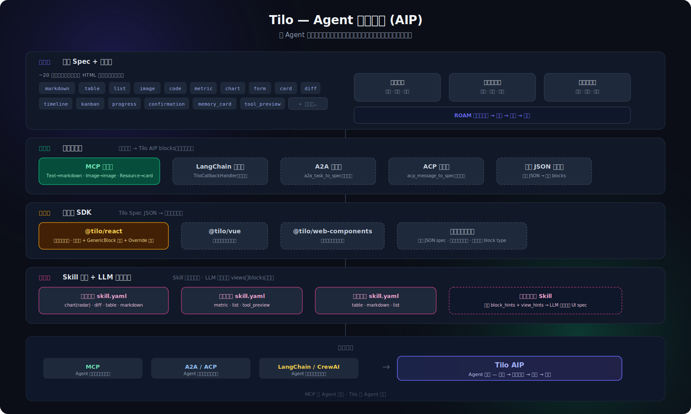

# Tilo Framework

<p align="center">
  <strong>Agent 交互协议（AIP）— 将 Agent 输出转化为可交互、可确认、可记忆的用户界面的开源运行时。</strong>
</p>

<p align="center">
  <a href="./README.md">English</a> ·
  <a href="./docs/AIP_DESIGN.md">AIP 设计文档</a> ·
  <a href="./docs/INTEGRATION_GUIDE.md">集成指南</a> ·
  <a href="./docs/BUILD_YOUR_FIRST_TILO_APP.md">构建 App</a> ·
  <a href="./docs/MEMORY.md">Memory</a> ·
  <a href="./docs/README.md">文档</a>
</p>

<p align="center">
  
  
  
  
  
  
</p>

<p align="center">
  
</p>

---

## 为什么是 Tilo

AI Agent 生态已经有了很好的**工具调用**方案（MCP）、**编排框架**（LangChain、CrewAI）、**通信协议**（A2A、ACP）。

缺的是什么？**Agent 输出到用户屏幕的最后一公里。**

```
MCP  = Agent 的手（调用工具）
A2A  = Agent 的嘴（Agent 间通信）
Tilo = Agent 的脸（输出 → 可交互界面）
```

Tilo 是一个 **Agent 交互协议（AIP）**：一套声明式 JSON spec，把 Agent 输出变成带有确认、记忆、可追溯能力的交互界面——支持任何前端框架渲染。

---

## 30 秒上手

```bash
pip install tilo
tilo serve
```

打开 `http://localhost:8000/api/health` 确认后端已启动。

完整体验（含参考前端）：

```bash
git clone https://github.com/adam2go/tilo-framework.git
cd tilo-framework
make install   # pip install + pnpm install
make dev       # 后端 :8000 + 前端 :4001
```

打开 `http://localhost:4001/demo`——选一个场景，看 Agent 思考、渲染、向你请示决策。

---

## 架构：四层设计

### 第一层 — 核心 Spec + 运行时

~20 个**原语块类型**（类似 HTML 标签：`markdown`、`table`、`chart`、`diff`、`form`、`card`……），加上开放扩展机制。任何字符串都是合法的 block type——未知类型用通用 JSON 查看器兜底渲染。

三大运行时支柱：**记忆引擎**（召回 → 候选 → 确认）、**确认收件箱**（高风险动作门控）、**链路追踪器**（每步可审计）。

### 第二层 — 协议适配器

外部协议零代码桥接为 Tilo blocks：

| 适配器 | 状态 | 映射 |
|---|---|---|
| **MCP** | ✅ 已实现 | TextContent→markdown，ImageContent→image，Resource→card |
| **LangChain** | 🔌 接口 | TiloCallbackHandler → Tilo spec |
| **A2A** | 🔌 接口 | A2A task result → Tilo spec |
| **ACP** | 🔌 接口 | ACP message → Tilo spec |

### 第三层 — 渲染器 SDK

Tilo Spec JSON → 任何前端。`@tilo/react` 是官方参考实现。开发者可以覆盖任何 block type 的渲染器，也可以为 Vue、Flutter、Web Components 或终端 CLI 构建自己的 SDK。

### 第四层 — Skill 提示 + LLM 动态组合

Skill 向 LLM 提供**提示**（推荐的块类型、视图组织方式）。LLM 有完全自主权决定最终的 views、blocks 和布局。Skill 是建议，不是约束。

---

## 三个内置 Demo

每个 Demo 都跑在同一套运行时上。Canvas 根据 Agent 产出的 Artifact 自动适配。

| 场景 | Agent 做了什么 | Canvas 视图 |
|---|---|---|
| **合同审查** 📋 | 阅读完整合同，按条款标注风险，起草修订意见 | 风险 · 条款 · 修订 · 记忆 |
| **销售跟进** 📊 | 分析管线，排序热门客户，建议外呼行动 | 管线 · 行动计划 |
| **竞品分析** 🏆 | 对比市场定位，识别差距和优势 | 对比 · 下一步 |

三个场景都支持**多轮对话**和 **LLM 驱动的 UI 组合**——LLM 根据 skill 提示和用户意图自主决定生成哪些 block 类型和 views。

---

## Tilo 的差异点

### 1. 开放的块类型系统

不同于固定的组件库，Tilo 的 ~20 个原语类型是**稳定且可扩展的**。95% 的场景用核心类型，领域特殊需求定义自定义类型——前端用通用 JSON 查看器优雅降级。

### 2. 确认式记忆——不是自动写入

```text
观察 → 记忆候选 → 用户确认 → 确认后的记忆
```

Agent 提出"我学到了什么"。用户决定什么能留下。

### 3. 后端拥有动作语义

```text
用户点击 → 动作运行时 → UI 交互事件 → 观察记录 → 安全副作用
```

前端只渲染意图。后端拥有语义。

### 4. 协议原生集成

带上你自己的 Agent 框架。Tilo 适配器把 MCP 工具结果、LangChain 输出、A2A 任务、ACP 消息桥接到同一个交互 Canvas——不需要重写你的 Agent 逻辑。

---

## 开发者如何集成

| 模式 | 适合场景 | 接触面 |
|---|---|---|
| **独立运行** | 本地评估 Tilo | `pip install tilo && tilo serve` |
| **MCP 适配器** | 已在用 MCP 工具 | `from tilo.adapters.mcp import mcp_content_to_blocks` |
| **后端 sidecar** | 已有自己的前端 | 调用 Tilo REST APIs |
| **嵌入组件** | 想用 AI-native UI 块 | 复用 `@tilo/react` 组件 + override |
| **Skill 作者** | 封装可复用工作流 | `skill.yaml` + `block_hints` + `view_hints` |
| **声明式 App** | 完整 Agent 工作流 | `app.yaml` + `interaction.policy.yaml` |

核心 API：

```text
POST /api/conversations                          创建会话
POST /api/conversations/{id}/messages             发送消息 → Task → Run
GET  /api/runs/{id}/trace                         实时链路追踪
GET  /api/artifacts?workspace_id=...&task_id=...  完整 Artifact（含 views）
POST /api/memories/{id}/confirm                   确认记忆候选
```

完整指南见 [`docs/INTEGRATION_GUIDE.md`](./docs/INTEGRATION_GUIDE.md) 和 [`docs/AIP_DESIGN.md`](./docs/AIP_DESIGN.md)。

---

## 仓库结构

```text
backend/       Python 包 `tilo` — FastAPI 运行时，pip 可安装
  tilo/adapters/   MCP、LangChain、A2A、ACP 协议适配器
  tilo/schemas/    AIP v1 spec：~20 个原语块类型 + 开放扩展
  tilo/services/   记忆、确认、追踪、Artifact、技能
frontend/      @tilo/react — Next.js 参考 UI，Artifact 驱动的 Canvas
skills/        Skill YAML 定义（block_hints + view_hints）
examples/      声明式 Agent App 和合同 fixture
docs/          架构、AIP 设计、集成指南、设计原则
evals/         运行时质量检查和 baseline 指标
```

---

## 路线图

**v0.1（当前）**——完整工作闭环 + AIP 架构。

- [x] Task → Run → Trace → Artifact → Surface → Confirmation → Memory 完整闭环
- [x] 三个 Demo 场景（合同审查、销售跟进、竞品分析）
- [x] Agent 交互协议（AIP）：~20 个原语块类型
- [x] LLM 驱动的 UI 组合 + Skill 提示
- [x] MCP 适配器（已实现）+ LangChain/A2A/ACP 接口
- [x] `pip install tilo` + `tilo serve` CLI
- [x] 多轮对话 + LLM streaming + 思考过程实时可见
- [ ] 完整适配器实现（LangChain、A2A、ACP）
- [ ] `@tilo/react` npm 包 + 渲染器覆盖 API
- [ ] Skill 市场 + YAML 技能加载
- [ ] 发布到 PyPI

**未来**——多 Agent 路由、带确认门控的真实工具执行、社区渲染器 SDK。

---

## 参与贡献

Tilo 还处于早期阶段，完全开源，欢迎参与。

贡献前请阅读：

- [`AGENTS.md`](./AGENTS.md) — 给 AI 编程 Agent 的开发规则
- [`CONTRIBUTING.md`](./CONTRIBUTING.md)
- [`docs/AIP_DESIGN.md`](./docs/AIP_DESIGN.md) — Agent 交互协议设计

最重要的原则：

> **MCP 是 Agent 的手，Tilo 是 Agent 的脸。始终保留 AIP 闭环：目标 → Spec → 交互界面 → 决策 → 记忆。**

---

## License

MIT License
